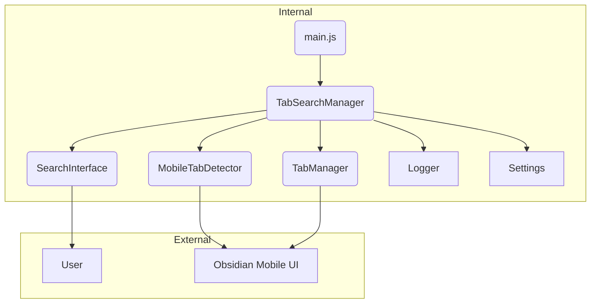

# systemPatterns.md

## 1. System Architecture
The plugin is built on a **modular, event-driven architecture**. The code is decoupled into distinct components, each with a single responsibility (e.g., detecting state, managing the UI, handling data). A central `TabSearchManager` orchestrates the interactions between these components, creating a clean and maintainable structure.

The following diagram illustrates the relationship between the core components of the plugin and the Obsidian environment.

- **`MobileTabDetector` (The Sentry):** Watches the app's state and emits events.
- **`SearchInterface` (The View):** Manages all visual elements and user interactions.
- **`TabManager` (The Data Layer):** Responsible for fetching, filtering, and acting upon the tab data.
- **`TabSearchManager` (The Conductor):** Listens for events from the Sentry and directs the View and Data Layer accordingly.

---

## 2. Detailed Component Breakdown
Here is a more detailed look at the role of each major component in the system.

#### Detection (`mobile-tab-detector.js` & `dom-observer.js`)
This component acts as the system's eyes and ears. It uses a highly efficient `MutationObserver` to watch for changes in the app's HTML structure, specifically looking for elements that indicate the mobile tab switcher is active (e.g., `.mobile-tab-switcher`). When it detects the correct state, it emits an event to the `TabSearchManager`. This ensures the plugin only activates when needed and remains dormant otherwise, preserving system resources.

#### Tab Management (`tab-manager.js`)
This is the data engine of the plugin. It employs a robust, **hybrid strategy** to gather a complete list of open tabs. It first scrapes the screen for visible tab elements (`.mobile-tab`) and their titles, then cross-references this with structured data from the official Obsidian Workspace API (`workspace.getLeavesOfType()`). This dual approach ensures maximum accuracy. This component is also responsible for handling the navigation logic when a user selects a tab from the search results, first attempting to simulate a direct click before falling back to an API call.

#### User Interface (`search-interface.js` & `mobile-utils.js`)
This component is responsible for everything the user sees and interacts with. It dynamically creates the floating search button and injects it onto the screen. To ensure a native look and feel, a utility finds Obsidian's own mobile buttons, reads their live CSS properties (like color and position), and applies them to the search button. It also manages the search overlay, input handling, **search term highlighting, the case-sensitivity toggle button,** and the real-time rendering of filtered results.

#### Central Coordination (`tab-search-manager.js` & `main.js`)
These files act as the central nervous system. `main.js` is the plugin's main entry point, handling the initial loading, settings registration, and setup. The `TabSearchManager` is the core orchestrator. It listens for state change events from the detector, tells the UI to show or hide, and passes the list of open tabs from the `TabManager` to the search interface when a search is initiated.

#### Settings (`settings.js`)
This component provides the user-facing configuration screen for the plugin within Obsidian's main settings area. It is responsible for rendering all the toggles, text fields, and dropdowns that allow users to customize the plugin's appearance and behavior, such as button positioning, search result limits, **the default case-sensitivity state,** and debug options. It then saves these settings, which are used by other components to modify their functionality.

#### Logger (`logger.js`)
This is a critical cross-cutting utility used by nearly every other component in the system. It provides a structured way to record events, warnings, and errors. It supports multiple logging levels (from `ERROR` to `TRACE`), automatically includes contextual information like timestamps and the platform (Mobile/Desktop), and can output to both the developer console and a dedicated log file (`debug.log`). This is essential for troubleshooting issues on mobile devices where direct debugging is difficult.

---

## 3. Key Technical Patterns
- **Observer Pattern:** The core of the plugin's efficiency lies in the `ObsidianDOMObserver`. It listens for specific changes to the app's HTML structure. The `TabSearchManager` then subscribes to events from this observer. This event-driven model is far more performant than a traditional polling (e.g., `setInterval`) approach, as the code only runs when a relevant change actually occurs.
- **Hybrid Strategy Pattern:** To ensure a comprehensive and accurate list of open tabs, the `TabManager` employs a hybrid data-sourcing strategy. It first scrapes the DOM and then uses the official API. This makes the data retrieval more robust.
- **Facade Pattern:** The `TabSearchManager` acts as a facade, providing a simple, unified interface to the plugin's more complex subsystems. The main plugin file (`main.js`) only needs to initialize the manager, which then handles all the complex inner workings.

---

## 4. Key Design Decisions
- **Mobile-Only Scope:** By targeting only the mobile platform, the design avoids the significant complexity of building a responsive UI that works across both desktop and mobile, resulting in a more focused and stable product.
- **Dynamic Theming:** A critical decision was to not hardcode appearance values. Instead, the plugin dynamically inspects the CSS properties of Obsidian's native mobile buttons and applies them to its own UI. This ensures the plugin always feels perfectly integrated with the user's current theme.
- **Decoupled Logic:** Separating the "what" (showing a search UI) from the "when" (detecting the tab switcher) into different modules makes the system highly maintainable. The detection method could be completely replaced in the future without requiring any changes to the UI code.